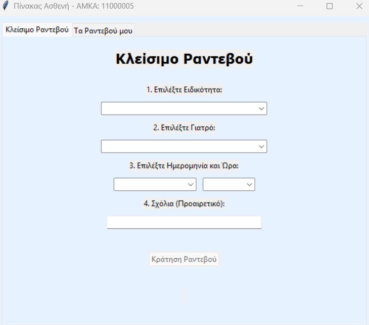

A **desktop medical appointment management system** built with **Python, Tkinter, SQLite**, featuring **real-time updates** using **MQTT**.

---

## Features

### Doctor
- Set weekly schedule & appointment duration
- View available & booked appointments
- View patient details
- Register payments
- **Real-time appointment updates (MQTT)**

### Patient
- View available appointments
- Book appointments
- View personal appointments & payment status

---

## Screenshots

### Login Window

### Doctor Login Window

### Patient Login Window

### Patient Register Window

### Doctor Dashboard

### Doctor Booked Appointments

### Doctor Appointments Details

### Patient Book Appointment Window

### Patient Cancel Appointment Window

