A **desktop medical appointment management system** built with **Python, Tkinter, SQLite**, featuring **real-time updates** using **MQTT**.

---

## Features

### Doctor
- Set weekly schedule & appointment duration
- View available & booked appointments
- View patient details
- Register payments
- **Real-time appointment updates (MQTT)**

### Patient
- View available appointments
- Book appointments
- View personal appointments 

---
## Requirements

- Python 3.x    
- paho-mqtt (`pip install paho-mqtt`)
- ALL FILES must be in the same folder
### Installation
1. Open command prompt(cmd)

2. Clone the repository:

git clone https://github.com/GiakoubM/clinic-appointments.git \
cd clinic_appointments\
3. Create a virtual environment (recommended)\
python -m venv .venv

4. Activate the virtual environment

Windows:

.venv\Scripts\activate

Linux / Mac:

source .venv/bin/activate 

5.Install requirements\
pip install -r requirements.txt

6. Create the database\
   python create_database.py

7.Run the application\
python connect_window.py

## Screenshots

### Login Window
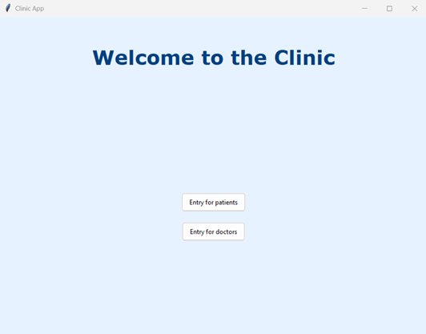
### Doctor Login Window

### Patient Login Window
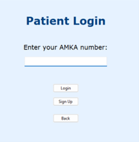
### Patient Register Window
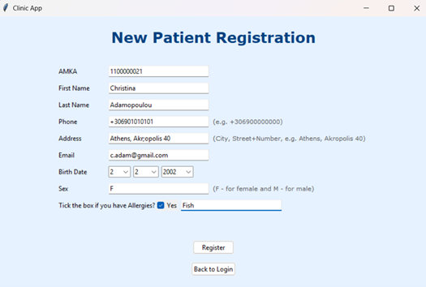

### Doctor Dashboard
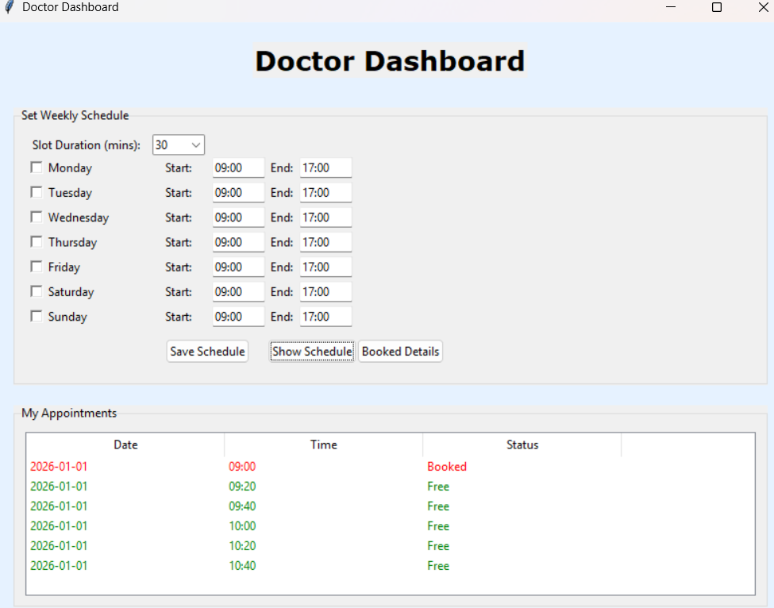
### Doctor Booked Appointments
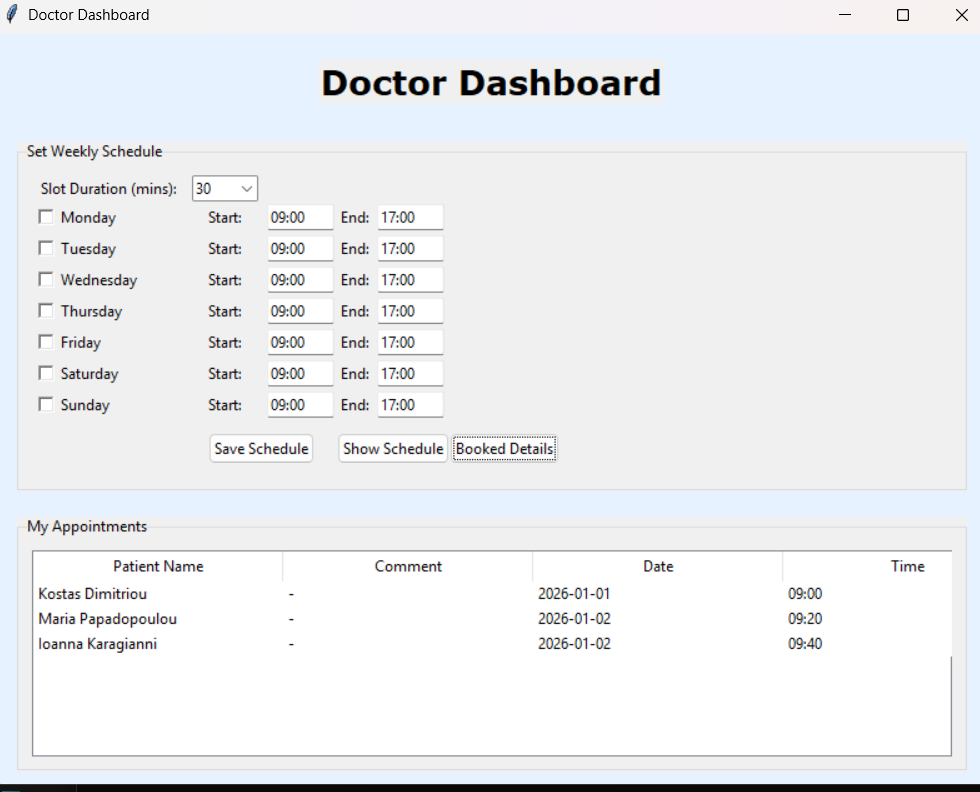
### Doctor Appointments Details
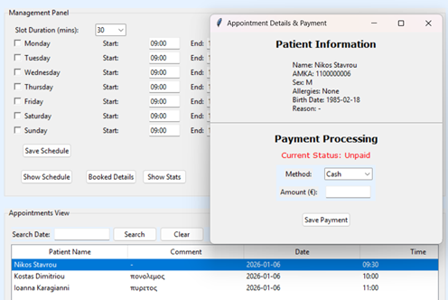
### Doctor Schedule And Search fo Appointments
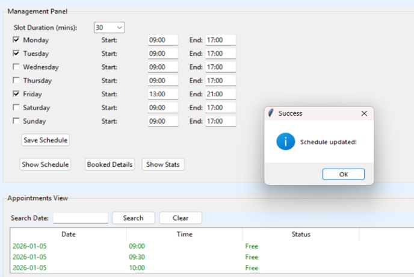
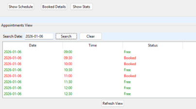
### Doctor Statistics and Payment Details
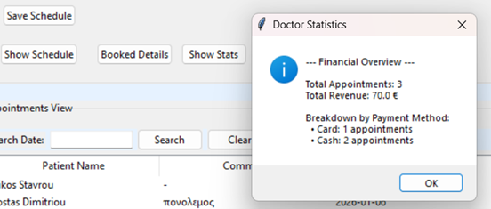
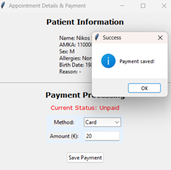 
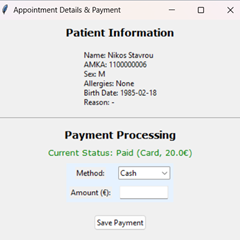

### Patient Book Appointment Window
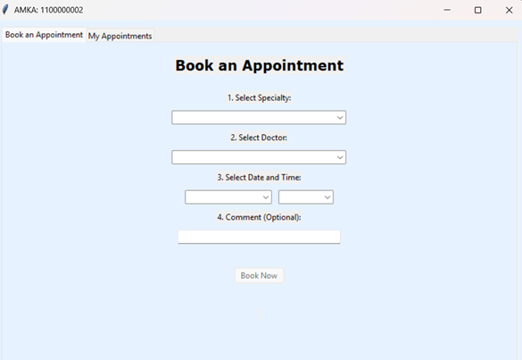
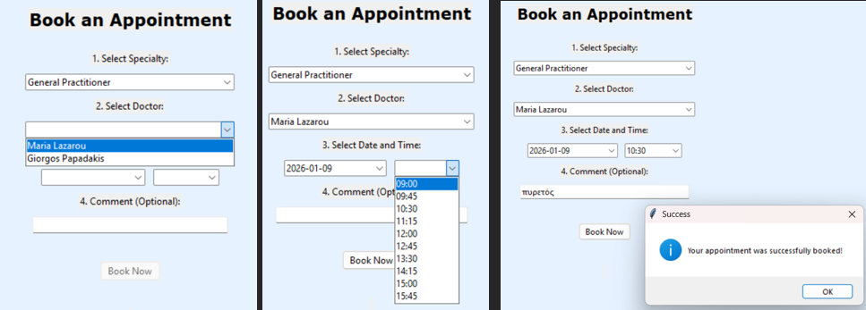
### Patient Cancel Appointment Window
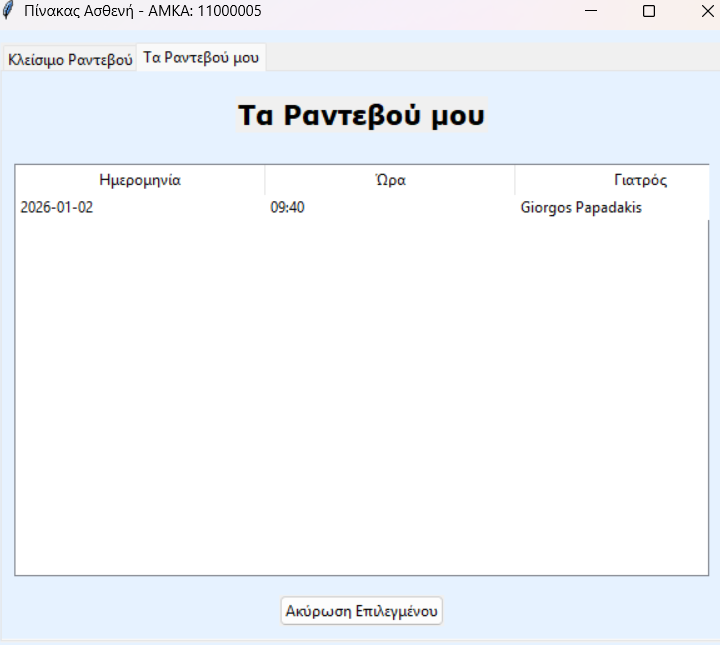

